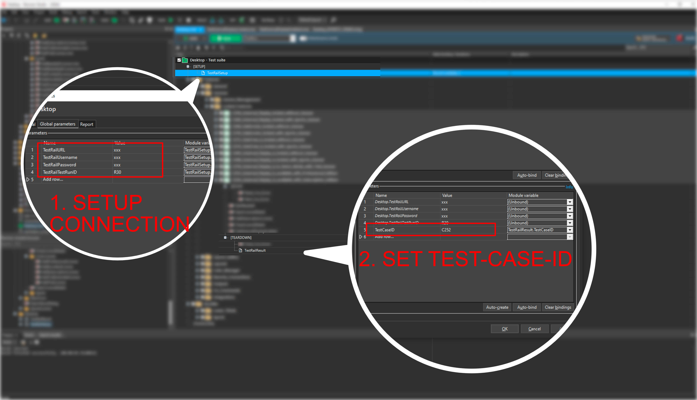

# Ranorex TestRail Integration

This integration helps you to get rid off the 2-way-sync between Ranorex and TestRail.

Do you have an **existing** TestRail project? ...a project with a structure that **must not be changed** by Ranorex? Then this package is perfect for you!

Simply add your TestRail credentials in Ranorex, decide what Test Results should be sent to TestRail and you're done!

This is a `TestRail-driven` workflow, so your QA team will always be in charge of the TestRail documentation and Ranorex will only work as a testing client and does **not modify** anything in your test cases anymore.

Define new test cases in TestRail, and add automation to it, when you are ready.

### 1. Installation
Open your Ranorex project, right click on your solution and click `Manage Packages`.
Now search `boxblinkracer.Ranorex.TestRail` in the NuGet package manager and add it to your project.

### 2. Setup TestRail credentials

Create a new `SETUP` section for your TestSuite and drag the `TestRailSetup` action into it.

Right click on it and open the `Data Bindings` dialog.

Now use "Auto-create", followed by "Auto-bind" to create the parameters.

It's time to enter your credentials:

* **TestRailURL**: Your TestRail URL, e.g. "https://mycompany.testrail.io"

* **TestRailUsername**: Your TestRail username

* **TestRailPassword**: Your TestRail password

* **TestRailTestRunID**: The prepared Test Run in TestRail that you want to send results to, e.g. "R30"

### 3. Add TestRailResult Action

Alright, we're actually done.
All we need to do now, is to decide what Ranorex tests are ready to work with TestRail.

Drag the `TestRailResult` action to your tests. I would recommend using it as last action in the `TEARDOWN` section of a test.

Right click on it and open the `Data Bindings` dialog.

Now use "Auto-create", followed by "Auto-bind" to create the parameters.

Enter the Test Case ID of a TestRail test that you want to verify with the currently selected Ranorex Test. Please keep in mind that this is a Test Case ID, like "C1", "C335".

This is completely decoupled from an actual Test Run. So we can really maintain our basic test setups in here.

### 4. Start Ranorex Tests

Start the Ranorex Test Suite and wait until your tests are finished.
The Ranorex Report will show detailed logs about the TestRail integration for every single test.

### Copying / License
This repository is distributed under the MIT License (MIT). You can find the whole license text in the [LICENSE](LICENSE) file.
